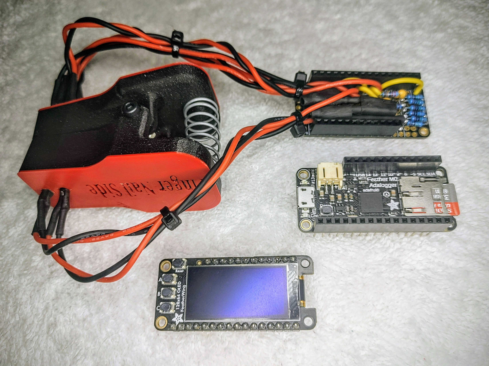

## _An Engineering Competition to Design and Build The Most Accurate Noninvasive Glucometer_
### Table of Contents
1. [Overview](#overview)
2. [Prizes](#prizes)
3. [How To Enter](#how-to-enter)
4. [Requirements, Rules, Constraints](#requirements-rules-constraints)
5. [How Entries Will Be Evaluated](#how-entries-will-be-evaluated)
6. [Example Sensor](#example-sensor)
7. [Current Competitors](#current-competitors)

## Overview
This is a competition to design and build the most accurate noninvasive glucometer sensor. 

The motivation for the competition is to increase the information available to the general public on noninvasive sensors by evaluating the accuracy of different sensor designs and to provide all the information needed to recreate those designs freely.  This is in the hopes that in the near future there may be an affordable sensor which can reliably provide accurate readings, and reduce the pain, cost, and waste associated with typical glucometers.

This repository is setup to also act as an Arduino library.  

The information provided here has not been evaluated by the Food and Drug Administration.  The information provided here is not intended to diagnose, treat, cure, or prevent any disease.

Please feel free to reach out to noninvasiveglucometer@gmail.com with any questions, suggestions, comments, or concerns.

## Prizes
To encourage some friendly competition, the following prizes are offered.  It should be noted though, that all competitors are contributing to the information available to the general public.  Knowing both what works well, and what does not, is of benefit to the public.
 - First Place $1000
 - Second Place $500
 - Third Place $250
 - Everyone, TBD, Stickers maybe?

## How To Enter
Make sure you are looking at the official repository at https://github.com/knowthebird/NoninvasiveGlucometer/. Updates to the compeition and results will be sent to the email address provided in the registration form.

  1. Fill out the [Registration Form](https://forms.gle/nVtzwGYVJsYVfvGZ8) no later than November 1, 2024. You can enter as an individual or as a team.
  2. Withing a few business days, you will receive an email notification that you have been entered into the contest. It will contain instructions for where to mail you sensor, source code, and documentation. (Will be East Coast United States).
  3. Design and build your sensor, following the requirements below.
  4. Mail your package per the instructions you received when you registered such that it arrives no later than December 1, 2024. Your sensor will be sent back to you after the competition is over.
  5. The winners and leaderboard will be announced by Jan 31, 2025.

## Requirements, Rules, Constraints
All of the following requirements must be met for the competition.

  1. Human Interface
     1. The Sensor must not harm the user.
     2. The Sensor must estimate the user's blood glucose level in milligrams per deciliter.
     3. The Sensor must attach to either a finger, wrist, hand, or ear lobe.
     4. The Sensor must not puncture the skin.
  2. SWaP-C
     1. The Sensor must fit in a USPS Small Flat Rate Box (8 5/8″ x 5 3/8″ x 1 5/8").
     2. The Sensor must weigh less than 2 lbs.
     3. The Sensor must accept power from standard US wall outlet (120 VAC RMS, Type A or Type B, 15A) or provide its own power (internal battery).
     4. The Sensor components must cost less than $200 USD in total.
  3. Hardware
     1. All hardware required to use the sensor must be provided. Note, this includes power source, sensor, processor, and display.
     2. You are encouraged (not required) to choose components which can be easily sourced or recreated. E.g. can be 3d printed versus export controlled.
  4. Software
     1. The sensor must be programmed with the necessary software to operate it. I.e. the user must not be required to build or upload software to operate the sensor.
     2. You are encouraged (not required) to write modular software that can be used as a library for future developers. E.g. this repo can be used as an Arduino library.
 5. Documentation
     1. All documentation must be provided under the MIT License. By entering the competition, you agree all documentation submitted can be shared publicly under the MIT License with the final results.
     2. All of the following documentation must be provided:
        1. A parts list, containing the Supplier, Part Number, Quantity Used, and Cost per Component for each component used.
        2. Dimensional drawings or STL files for any custom made mechanical components.
        3. Wiring schematics for any custom made electrical components.
        4. All source code used.
    3. Your documentation does not need to be shared publicly before the final results and winners are announced. If you share it, you agree to allow competitors to use it. It is your responsibility to protect your documentation before then if that is not desired.

## How Entries Will Be Evaluated
All entries will be evaluated using the same methods.  The exact method used is still TBD based on the number of submissions and number of volunteers to test the sensors.  Accuracy will be evaluated relative to a commercial blood based glucometer.   Any additional information will be added to this section in the official repository at https://github.com/knowthebird/NoninvasiveGlucometer/

## Example Sensor
This repository is not an empty template for a competition. It also contains a noninvasive sensor, which is still in development, for reference.  It is an example of one way to approach the problem, and the succeses and failures of it will be shared. You are not competing with the example, but you can recreate it, and/or modify it, to enter in the contest.

  
  

This example is setup such that the sensor should interface like a Wing with an Adafruit Feather.  See https://learn.adafruit.com/adafruit-feather/overview for reference. The hope is this will help to create a modular system where it is easy to make updates and test new sensors.

So far with the example sensor, only weak correlations have been observed.  This has relatively little significance at this point though, because it has only logged a very small amount of data with a relatively small range of blood glucose levels.  Getting a large set of samples, with a range in blood glucose levels, to both train and test models, is a challenge for any new sensor developemnt.  Without a range of data, initial results, such as MARD or RMSE, can be very misleading.

#### YoutTube Video - Noninvasive Glucometer, Part 1, Initial Design Progress 

## Current Competitors

No one has joined yet.  Give it a shot!

| Alias or Team Name | Individual or Team | School, Business, or Organization |
| :--------- | :-------- | :------- |
| None yet   | None yet  | None yet |

